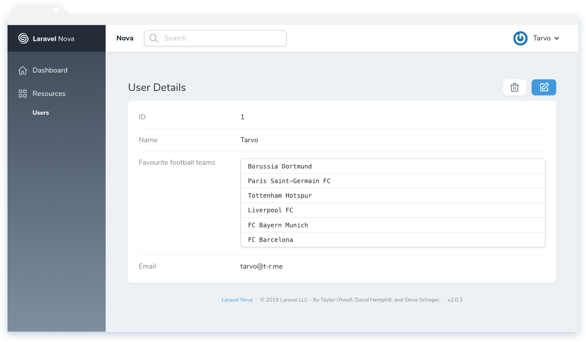
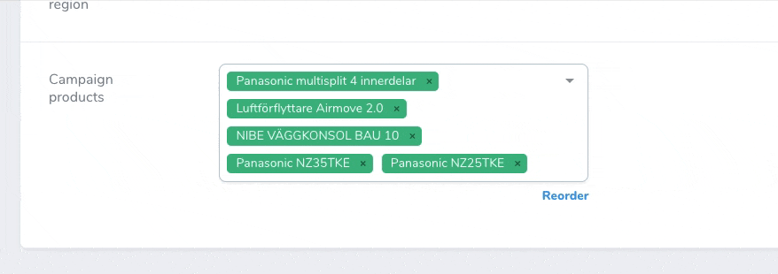

# Nova Multiselect

[](https://packagist.org/packages/optimistdigital/:nova-multiselect-field)
[](https://packagist.org/packages/optimistdigital/:nova-multiselect-field)

This [Laravel Nova](https://nova.laravel.com) package adds a multiselect to Nova's arsenal of fields.'

## Requirements

- Laravel Nova ^2.0.11

For Nova version earlier than 2.0.11 please use `nova-multiselect-field` version `1.1.6` or earlier.

This restriction is due to `Nova::translatable()` method being added in 2.0.11, which allows this package to be localized.

## Features

- Multiselect w/ search
- Single select w/ search
- Reordering functionality with drag & drop

## Screenshots






## Installation

Install the package in a Laravel Nova project via Composer:

```bash
composer require optimistdigital/nova-multiselect-field
```

## Usage

The field is used similarly to Nova's native Select field. The field type in the database should be text-based (ie `string`, `text` or `varchar`), selected values are stored as a stringified JSON array.

```php
use OptimistDigital\MultiselectField\Multiselect;

public function fields(Request $request)
{
    return [
      Multiselect
        ::make('Favourite football teams', 'football_teams')
        ->options([
          'liverpool' => 'Liverpool FC',
          'tottenham' => 'Tottenham Hotspur',
          'bvb' => 'Borussia Dortmund',
          'bayern' => 'FC Bayern Munich',
          'barcelona' => 'FC Barcelona',
          'juventus' => 'Juventus FC',
          'psg' => 'Paris Saint-Germain FC',
        ])

        // Optional:
        ->placeholder('Choose football teams')
        ->max(4)
        ->optionsLimit(5)
        ->reorderable()
    ];
}
```

## Options

Possible options you can pass to the field using the option name as a function, ie `->placeholder('Choose peanuts')`.

| Option                        | type     | default    | description                                                                                                                                                                  |
| ----------------------------- | -------- | ---------- | ---------------------------------------------------------------------------------------------------------------------------------------------------------------------------- |
| `options`                     | Array    | []         | Options in an array as key-value pairs (`['id' => 'value']`).                                                                                                                |
| `placeholder`                 | String   | Field name | The placeholder string for the input.                                                                                                                                        |
| `max`                         | Number   | Infinite   | The maximum number of options a user can select.                                                                                                                             |
| `singleSelect`                | Boolean  | false      | Makes the field act as a single select which also means the saved value will not be an array.                                                                                |
| `saveAsJSON`                  | Boolean  | false      | When you have a SQL JSON column, you can force the field to save the values as JSON. By default, values are saved as a stringified array.                                    |
| `optionsLimit`                | Number   | 1000       | The maximum number of options displayed at once. Other options are still accessible through searching.                                                                       |
| `nullable`                    | Boolean  | false      | If the field is nullable an empty select will result in `null` else an empty array (`[]`) is stored.                                                                         |
| `reorderable`                 | Boolean  | false      | Enables (or disables) the reordering functionality of the multiselect field.                                                                                                 |
| `resolveForPageResponseUsing` | Callable | null       | Only for use in conjunction with [Page Manager](https://github.com/optimistdigital/nova-page-manager). Allows you to format the value before it is returned through the API. |

## Localization

The translations file can be published by using the following publish command:

```bash
php artisan vendor:publish --provider="OptimistDigital\MultiselectField\FieldServiceProvider" --tag="translations"
```

You can then edit the strings to your liking.

## Overwriting the detail field

You can overwrite the detail view value component to customize it as you see fit.

Create a new component for `NovaMultiselectDetailFieldValue` and register it in your `app.js`. The component receives two props: `field` and `values`. The `values` prop is an array of selected labels.

```js
// in NovaMultiselectDetailFieldValue.vue

<template>
  <div class="relative rounded-lg bg-white shadow border border-60" v-if="values">
    <div class="overflow-hidden rounded-b-lg rounded-t-lg">
      <div class="border-b border-50 cursor-text font-mono text-sm py-2 px-4" v-for="(value, i) of values" :key="i">
        {{ value }}
      </div>
    </div>
  </div>

  <div v-else>—</div>
</template>

<script>
export default {
  props: ['field', 'values'],
};
</script>
```

```js
// in app.js

import NovaMultiselectDetailFieldValue from './NovaMultiselectDetailFieldValue';

Nova.booting((Vue, router, store) => {
  Vue.component('nova-multiselect-detail-field-value', NovaMultiselectDetailFieldValue);
});
```

## Credits

- [Tarvo Reinpalu](https://github.com/Tarpsvo)
- [shentao/vue-multiselect](https://vue-multiselect.js.org)

## License

This project is open-sourced software licensed under the [MIT license](LICENSE.md).
